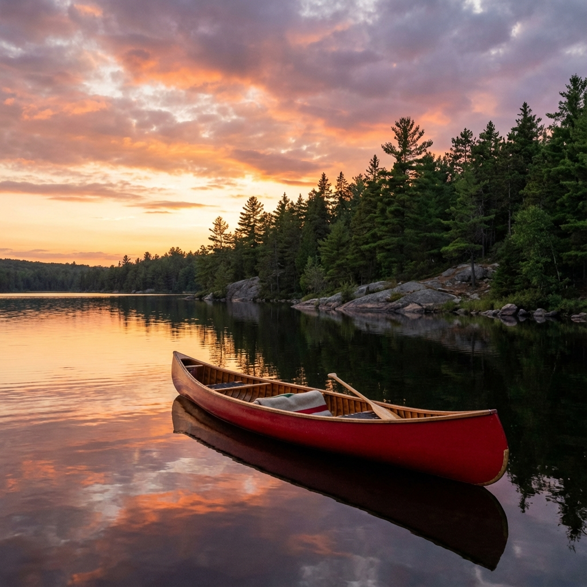

The morning mist was still clinging to the water when we pushed off from the Achray campground. Our plan was ambitious but manageable: a four-day loop taking us down through the spectacular Barron Canyon and back up via a series of smaller, portage-heavy lakes.

## Day 1: Into the Canyon

The paddle to the canyon entrance was deceptively calm. Grand Lake lived up to its name—vast and open—but the wind was mercifully at our backs. As we narrowed into the Barron River, the mood shifted. We were entering a wilder place.

The canyon walls rose up around us, 100 meters of sheer granite. We stopped drifting and just let the current take us, necks craned upward. It's easy to feel small in a canoe, but here, you feel microscopic.

### Camp Life

We set up camp just past the canyon on a site with a rocky point. Dinner was our traditional first-night steak, cooked over the fire as the stars began to poke through the twilight. The loons were calling—a sound that, no matter how many times I hear it, always signals that I'm truly away. My list of things to do today:

- Take a long walk
- Go for a swim
- Read a book
- Watch the stars
- Listen to the wind

My favorite meals in order of priority:

1. Steak
2. Pasta
3. Rice
4. Grilled cheese

## Day 2: The Portage

"Portage" is a French word meaning "to carry," but I'm pretty sure it's actually derived from an ancient term for "suffering." The 1400m climb out of the river valley was a test of legs and will. But the reward was High Falls Lake, a sparkling gem that felt untouched.

We spent the afternoon swimming and drying out on the warm rocks. This is the rhythm of the trip: work hard, rest hard.

## Reflections

As we paddled back to Achray on the final day, fighting a headwind this time, I thought about why we do this. It's not just for the views, though they are incredible. It's for the simplicity. For a few days, life is reduced to the basics: shelter, food, movement. And that is a powerful reset.
